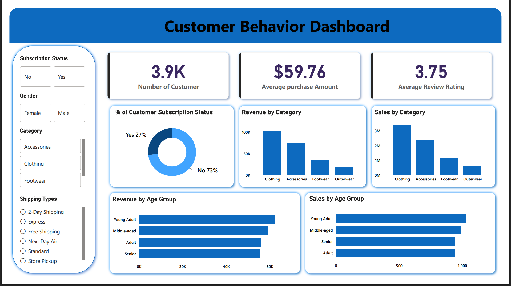

# 📊 Customer Behavior Analysis

> An end-to-end data analytics project focused on understanding customer purchasing behavior, spending patterns, product performance, discount usage, subscription behavior, customer segmentation, shipping preferences, and revenue contribution using **Python, SQL, and Power BI**.

---

## 📌 Project Overview

Customer Behavior Analysis is an end-to-end data analytics project built to transform customer shopping transaction data into meaningful business insights.

The project combines **Python, SQL, and Power BI** to analyze customer purchases, spending behavior, product ratings, discounts, subscriptions, shipping types, customer segments, categories, gender, and age groups.

The analysis is driven by practical business questions and concludes with an interactive Power BI dashboard that provides a consolidated view of customer and sales performance.

---

# 📊 Dashboard Preview



> The dashboard provides an interactive view of customer KPIs, subscription status, category performance, gender, shipping types, sales, and revenue across age groups.

---

# 🎯 Problem Statement

Businesses generate significant amounts of customer transaction data, but raw transactional data does not directly explain customer behavior or business performance.

The objective of this project is to analyze customer shopping behavior and answer key business questions related to:

* Customer spending
* Revenue generation
* Product performance
* Discount usage
* Subscription behavior
* Customer loyalty
* Shipping preferences
* Category performance
* Gender-based revenue
* Age-group contribution

The analysis aims to convert transactional data into structured insights that can support data-driven business decisions.

---

# 🎯 Project Objectives

* Analyze overall customer purchasing behavior
* Understand customer spending patterns
* Compare revenue across customer groups
* Evaluate subscription adoption and performance
* Analyze discount usage across products
* Identify highly rated products
* Identify frequently purchased products
* Segment customers based on previous purchases
* Compare spending across shipping types
* Analyze revenue contribution across age groups
* Build an interactive Power BI dashboard
* Demonstrate practical SQL and analytical skills

---

# 📈 Key Performance Indicators

| KPI                         |      Value |
| --------------------------- | ---------: |
| 👥 Number of Customers      |   **3.9K** |
| 💰 Average Purchase Amount  | **$59.76** |
| ⭐ Average Review Rating     |   **3.75** |
| 🔔 Subscribed Customers     |    **27%** |
| 🚫 Non-Subscribed Customers |    **73%** |

These KPIs provide a high-level view of the customer base, average spending, customer ratings, and subscription adoption.

---

# 🔍 Key Insights

### 1. Subscription Distribution

The customer base consists of:

* **27% subscribed customers**
* **73% non-subscribed customers**

This shows that non-subscribers represent the larger portion of the customer base.

---

### 2. Average Customer Spending

The overall average purchase amount is **$59.76**.

This metric provides a benchmark for evaluating purchases that are above or below the overall average.

---

### 3. Customer Reviews

The average review rating is **3.75**, providing an overall indicator of customer feedback across purchases.

The SQL analysis further identifies the **top 5 products based on average review rating**.

---

### 4. Discount & Spending Behavior

The SQL analysis identifies customers who:

* Applied a discount
* Still spent at or above the overall average purchase amount

This allows the analysis to examine high-value purchases made under promotional conditions.

---

### 5. Customer Segmentation

Customers are categorized according to previous purchase history:

| Segment       | Previous Purchases |
| ------------- | -----------------: |
| **New**       |                  1 |
| **Returning** |               2–10 |
| **Loyal**     |                >10 |

This provides a structured way to analyze customer purchasing history.

---

### 6. Product Performance

The analysis identifies:

* Top 5 products by average review rating
* Top 5 products by discount purchase rate
* Top 3 most purchased products within each category

This provides both customer-feedback and purchasing-frequency perspectives on product performance.

---

### 7. Subscription & Spending

Subscriber and non-subscriber groups are compared using:

* Total customer count
* Average purchase amount
* Total revenue

This allows subscription performance to be evaluated from both customer and financial perspectives.

---

### 8. Repeat Buyers

Customers with **more than 5 previous purchases** are analyzed according to subscription status.

This provides a way to investigate the relationship between repeat purchasing behavior and subscription adoption.

---

### 9. Category Performance

The Power BI dashboard analyzes sales and revenue across:

* Clothing
* Accessories
* Footwear
* Outerwear

This enables category-level performance monitoring.

---

### 10. Age-Group Performance

The dashboard analyzes both sales and revenue across:

* Young Adult
* Middle-aged
* Adult
* Senior

This provides a demographic perspective on customer purchasing contribution.

---

# 💼 Business Insights

The analytical findings can be interpreted from a business perspective as follows:

### 🔔 Subscription Strategy

With **73% of customers currently classified as non-subscribers**, subscription conversion represents an area that can be explored further through targeted offers, customer engagement, and retention analysis.

### 💰 Customer Value

The **$59.76 average purchase amount** provides a useful benchmark for identifying relatively higher-value purchasing behavior.

### 🏷️ Discount Strategy

The analysis of discounted purchases alongside purchase amounts can help businesses understand whether promotional offers are associated with meaningful customer spending.

### ⭐ Product Strategy

Identifying highly rated products can help businesses understand products receiving stronger customer feedback and use those products for further product-level analysis.

### 👥 Customer Retention

The New, Returning, and Loyal customer segmentation provides a foundation for developing differentiated customer-retention strategies.

### 🔄 Repeat Customer Engagement

Analyzing repeat buyers alongside subscription status can help investigate whether customers with stronger purchasing histories are more engaged with subscription programs.

### 📦 Shipping Strategy

Comparing Standard and Express shipping purchase amounts provides a basis for understanding purchasing behavior across shipping preferences.

### 🛍️ Category Performance

Revenue and sales analysis across product categories enables businesses to monitor category-level performance and identify areas requiring deeper investigation.

### 👤 Demographic Analysis

Gender and age-group analysis provides additional customer-level context for understanding revenue and purchasing patterns.

---


# 🧠 Business Questions & Answers

The SQL analysis was designed around 10 practical business questions. Each question was converted into a SQL query to extract customer, product, sales, subscription, and revenue-related insights.

| #       | Business Question                                                                      | Answer / Result                                                                                                                                               |
| ------- | -------------------------------------------------------------------------------------- | ------------------------------------------------------------------------------------------------------------------------------------------------------------- |
| **Q1**  | What is the total revenue generated by male vs. female customers?                      | Revenue is grouped by gender using `SUM(purchase_amount)` to compare the total revenue generated by male and female customers.                                |
| **Q2**  | Which customers used a discount but still spent more than the average purchase amount? | Customers are identified when `discount_applied = 'Yes'` and their purchase amount is greater than or equal to the overall average purchase amount.           |
| **Q3**  | Which are the top 5 products with the highest average review rating?                   | The top 5 products are identified by calculating the average review rating for each product and ranking them in descending order.                             |
| **Q4**  | How do average purchase amounts compare between Standard and Express Shipping?         | Average purchase amounts are calculated separately for Standard and Express shipping to compare customer spending across the two shipping methods.            |
| **Q5**  | Do subscribed customers spend more than non-subscribers?                               | Subscribers and non-subscribers are compared using customer count, average purchase amount, and total revenue.                                                |
| **Q6**  | Which 5 products have the highest percentage of purchases with discounts applied?      | The discount rate is calculated for each product, and the five products with the highest discount purchase percentage are identified.                         |
| **Q7**  | How can customers be segmented into New, Returning, and Loyal customers?               | Customers are classified as **New** with 1 previous purchase, **Returning** with 2–10 previous purchases, and **Loyal** with more than 10 previous purchases. |
| **Q8**  | What are the top 3 most purchased products within each category?                       | Products are ranked within each category using purchase count, and the top 3 products from every category are identified.                                     |
| **Q9**  | Are repeat buyers also likely to subscribe?                                            | Customers with more than 5 previous purchases are grouped by subscription status to compare subscription behavior among repeat buyers.                        |
| **Q10** | What is the revenue contribution of each age group?                                    | Total purchase revenue is aggregated by age group and ranked from highest to lowest revenue contribution.                                                     |

---

## 📌 Analytical Answers & Interpretation

### Q1 — Revenue by Gender

**Approach:** Total purchase revenue is aggregated separately for male and female customers.

**Business interpretation:** This comparison helps identify differences in revenue contribution across customer genders and can support demographic-level customer analysis.

---

### Q2 — Discounted Purchases Above Average

**Approach:** Customers are filtered where a discount was applied and the purchase amount is at least equal to the overall average purchase amount.

**Business interpretation:** This helps identify relatively high-value purchases made while discounts were applied and can support evaluation of promotional customer behavior.

---

### Q3 — Top 5 Highest-Rated Products

**Approach:** Average review ratings are calculated for every product and the five highest-rated products are selected.

**Business interpretation:** Highly rated products can be examined further to understand customer satisfaction and product-level performance.

---

### Q4 — Standard vs. Express Shipping

**Approach:** Average purchase amount is calculated separately for Standard and Express shipping.

**Business interpretation:** Comparing these two groups helps understand whether purchasing value differs according to shipping preference.

---

### Q5 — Subscriber vs. Non-Subscriber Performance

**Approach:** The analysis compares:

* Number of customers
* Average purchase amount
* Total revenue

between subscribers and non-subscribers.

**Dashboard context:** The overall customer base contains **27% subscribers and 73% non-subscribers**.

**Business interpretation:** Subscription performance can be evaluated not only by customer count but also by spending and revenue contribution.

---

### Q6 — Products with Highest Discount Rate

**Approach:** For every product, the percentage of purchases where a discount was applied is calculated. The five products with the highest percentage are selected.

**Business interpretation:** This analysis helps identify products that are frequently purchased under promotional or discounted conditions.

---

### Q7 — Customer Segmentation

Customers are classified based on previous purchase history:

| Customer Segment | Previous Purchases |
| ---------------- | -----------------: |
| **New**          |                  1 |
| **Returning**    |               2–10 |
| **Loyal**        |       More than 10 |

**Business interpretation:** This segmentation provides a simple framework for understanding customer loyalty and developing targeted retention strategies.

---

### Q8 — Top Products Within Each Category

**Approach:** Purchase counts are calculated for each product within each category. `ROW_NUMBER()` is then used to rank products within their respective categories.

**Business interpretation:** This allows businesses to identify the strongest-performing products within each product category.

---

### Q9 — Repeat Buyers & Subscription

**Approach:** Customers with more than 5 previous purchases are considered repeat buyers for this analysis. Their subscription status is then compared.

**Business interpretation:** This helps investigate whether stronger purchasing history is associated with subscription adoption.

---

### Q10 — Revenue by Age Group

**Approach:** Total purchase amount is aggregated for each age group and sorted by revenue.

**Dashboard context:** The dashboard analyzes **Young Adult, Middle-aged, Adult, and Senior** customers using both revenue and sales views.

**Business interpretation:** Age-group revenue analysis provides demographic context for understanding customer contribution to overall revenue.

---

## 🎯 Overall Analytical Findings

The project provides a consolidated view of customer behavior through:

* **3.9K customers**
* **$59.76 average purchase amount**
* **3.75 average review rating**
* **27% subscribed customers**
* **73% non-subscribed customers**

The analysis combines customer spending, product performance, discounts, subscription behavior, customer segmentation, shipping methods, categories, gender, and age groups to provide a broader understanding of customer shopping behavior.
                                   

---

# 🗄️ SQL Analysis

The SQL analysis transforms business requirements into structured analytical queries.

### SQL File

```text id="1r3y8f"
Customer_Behavior_Analysis.sql

```

### SQL Analysis Includes

* Revenue by gender
* Above-average discounted purchases
* Top-rated products
* Standard vs. Express shipping comparison
* Subscriber vs. non-subscriber analysis
* Product discount rates
* Customer segmentation
* Product ranking within categories
* Repeat buyer subscription analysis
* Revenue by age group

---

# 🧩 SQL Concepts Demonstrated

The project demonstrates practical SQL techniques including:

* `SELECT`
* `WHERE`
* `GROUP BY`
* `ORDER BY`
* `SUM()`
* `AVG()`
* `COUNT()`
* `CASE`
* Subqueries
* Common Table Expressions (CTEs)
* Window Functions
* `ROW_NUMBER()`
* Conditional aggregation
* Percentage calculations
* Ranking
* Customer segmentation

### Example Analytical Techniques

**Aggregate Functions**

Used to calculate revenue, average spending, customer counts, and ratings.

**CASE Statements**

Used to classify customers into New, Returning, and Loyal segments.

**Subqueries**

Used to compare individual purchase amounts against the overall average.

**CTEs**

Used to organize multi-step analytical logic.

**Window Functions**

`ROW_NUMBER()` is used to rank products within individual categories.

---

# 🐍 Python Analysis

Python is used as part of the analytical workflow to work with the customer shopping behavior dataset.

### Python File

```text id="4kz8az"
Customer_Behavior_Analysis.ipynb
```

### Technologies

* Python
* Pandas
* Jupyter Notebook

The notebook forms the Python component of the end-to-end analytics workflow.

---

# 📊 Power BI Dashboard

The Power BI dashboard presents the project's analytical results in an interactive business-reporting format.

### Power BI File

```text id="h2n6tm"
Customer_Behavior_Dashboard.pbix

```

### Dashboard PDF

```text id="m0xv5c"
Customer_Behavior_Dashboard.pdf
```

### Dashboard Includes

#### KPI Cards

* Number of Customers
* Average Purchase Amount
* Average Review Rating

#### Customer Analysis

* Subscription Status
* Gender
* Category
* Shipping Types

#### Sales & Revenue Analysis

* Revenue by Category
* Sales by Category
* Revenue by Age Group
* Sales by Age Group

---

# 🎛️ Dashboard Filters

The dashboard provides analytical filtering across dimensions including:

* Subscription Status
* Gender
* Category
* Shipping Types

This allows the user to explore different customer and transaction segments interactively.

---

# 🛍️ Product & Category Analysis

The project analyzes customer purchasing behavior at both category and product levels.

### Categories

* Clothing
* Accessories
* Footwear
* Outerwear

### Product-Level Analysis

* Top-rated products
* Most purchased products
* Products with high discount usage
* Top products within each category

---

# 👥 Customer Analysis

Customer behavior is analyzed through multiple dimensions:

### Subscription

* Subscriber
* Non-subscriber

### Gender

* Female
* Male

### Customer Segmentation

* New
* Returning
* Loyal

### Age Groups

* Young Adult
* Middle-aged
* Adult
* Senior

---

# 📦 Shipping Analysis

The project analyzes customer behavior across different shipping methods.

The dashboard includes:

* 2-Day Shipping
* Express
* Free Shipping
* Next Day Air
* Standard
* Store Pickup

The SQL analysis specifically compares average purchase amounts between **Standard** and **Express** shipping.

---

# 🔄 End-to-End Analytics Workflow

```text id="z7o4lu"
              Customer Shopping Data
                       │
                       ▼
                Data Preparation
                       │
                       ▼
             Python / Jupyter Analysis
                       │
                       ▼
                Business Questions
                       │
                       ▼
                  SQL Analysis
                       │
                       ▼
             KPI & Metric Analysis
                       │
                       ▼
               Power BI Dashboard
                       │
                       ▼
                Business Insights
```

---

# 💼 Business Value

This project demonstrates how raw customer transaction data can be converted into structured business analysis.

The analysis can support areas such as:

* Customer segmentation
* Customer retention
* Subscription strategy
* Product performance
* Discount strategy
* Revenue analysis
* Category performance
* Shipping analysis
* Customer purchasing behavior
* Demographic analysis

The project demonstrates an analytical workflow that connects **business questions → data analysis → SQL → KPIs → visualization → business interpretation**.

---

# 📂 Repository Structure

```text id="lq7e4p"
customer-behavior-analysis/
│
├── Customer_Behavior_Analysis.ipynb
│   └── Python / Jupyter Notebook analysis
│
├── Customer_Behavior_Analysis.sql
│   └── SQL business analysis queries
│
├── Customer_Behavior_Dashboard.pbix
│   └── Editable Power BI dashboard
│
├── Customer_Behavior_Dashboard.pdf
│   └── PDF export of the Power BI dashboard
│
├── customer behavior SQL Queries.pdf
│   └── Documented SQL queries
│
├── customer_shopping_behavior.csv
│   └── Customer shopping behavior dataset
│
├── images/
│   └── dashboard.png
│       └── Dashboard preview image
│
└── README.md
    └── Project documentation
```

---

# 📁 Project Files

| File                                | Description                            |
| ----------------------------------- | -------------------------------------- |
| `Customer_Behavior_Analysis.ipynb`  | Python/Jupyter Notebook analysis       |
| `Customer_Behavior_Analysis.sql`    | SQL queries used for business analysis |
| `Customer_Behavior_Dashboard.pbix`  | Editable Power BI dashboard            |
| `Customer_Behavior_Dashboard.pdf`   | PDF version of the dashboard           |
| `customer behavior SQL Queries.pdf` | Documented SQL queries                 |
| `customer_shopping_behavior.csv`    | Customer shopping behavior dataset     |
| `README.md`                         | Project documentation                  |

---

# 📦 Dataset

The project uses the following dataset:

```text id="f0qz8a"
customer_shopping_behavior.csv
```

The dataset contains customer shopping behavior information used for the Python, SQL, and Power BI analysis.

> If the dataset was obtained from a third-party source, the original source and applicable dataset license/attribution should be retained in the repository.

---

# 📊 Project Deliverables

### Data Analysis

Python/Jupyter Notebook for working with the customer shopping behavior data.

### SQL Business Analysis

SQL queries addressing 10 practical customer and business questions.

### Customer Segmentation

Classification of customers into New, Returning, and Loyal segments based on previous purchases.

### KPI Analysis

High-level customer, purchase, rating, and subscription metrics.

### Power BI Dashboard

Interactive visualization of customer, sales, revenue, category, subscription, shipping, gender, and age-group analysis.

### Documentation

SQL query documentation and complete project README.

---

# 🚀 Future Enhancements

The analysis can be extended with additional analytical capabilities such as:

* Customer Lifetime Value (CLV)
* RFM Analysis
* Customer Churn Analysis
* Customer Retention Rate
* Cohort Analysis
* Subscription Conversion Analysis
* Sales Trend Analysis
* Revenue Forecasting
* Discount Impact Analysis
* Product Recommendation Analysis

---

# ✅ Conclusion

Customer Behavior Analysis demonstrates an end-to-end data analytics workflow using **Python, SQL, and Power BI**.

The project starts with customer shopping transaction data, uses Python and SQL to investigate practical business questions, and presents the results through an interactive Power BI dashboard.

The analysis covers **customer spending, revenue, product ratings, discounts, subscriptions, customer segmentation, repeat buyers, shipping types, categories, gender, and age groups**.

The final dashboard and analytical outputs provide a structured view of customer behavior and business performance, demonstrating how data can be transformed into useful business insights.
